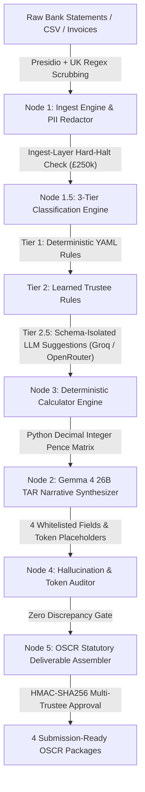

# Beacon Compliance OS

<p align="center">
  
</p>

> **Beacon Compliance OS is an agentic OSCR-compliance web application engineered specifically for Potter's House Christian Mission UK (SCIO, SC054652). It deterministically computes statutory accounts, synthesizes narrative reports under strict document contracts, tracks filing deadlines, provides real-time streaming compliance chat, and cryptographically signs submission packages—governed by 5 non-negotiable compliance red-lines.**


---

## 📋 Table of Contents

- [System Architecture & Core Principles](#system-architecture--core-principles)
- [Key Features](#key-features)
- [Master Agent Prompts Architecture](#master-agent-prompts-architecture)
- [Option A Institutional Document Standards](#option-a-institutional-document-standards)
- [Technology Stack](#technology-stack)
- [Repository Structure](#repository-structure)
- [Database & Idempotent Migrations](#database--idempotent-migrations)
- [Environment Configuration & Secrets](#environment-configuration--secrets)
- [Local Quick Start & Verification](#local-quick-start--verification)
- [Automated Testing & Pre-Flight Audits](#automated-testing--pre-flight-audits)
- [CI/CD & Production Deployment](#cicd--production-deployment)
- [Security & Compliance Red-Lines](#security--compliance-red-lines)
- [License & Statutory Identity](#license--statutory-identity)

---

## 🏗️ System Architecture & Core Principles

Beacon Compliance OS is built strictly to automate statutory reporting to the **Office of the Scottish Charity Regulator (OSCR)** under the *Charities and Trustee Investment (Scotland) Act 2005* and the *Charities Accounts (Scotland) Regulations 2006 (SSI 2006/218)*.

The core compliance workflow is driven by an automated, idempotent **LangGraph state machine (`BeaconComplianceGraph`)** that coordinates data ingestion, multi-tier transaction classification, deterministic accounting arithmetic, narrative synthesis under document contracts, hallucination auditing, and final deliverable assembly.

### LangGraph Pipeline Topology



### Deterministic vs. Probabilistic Boundary Matrix

To guarantee absolute compliance with Scottish charity law and eliminate LLM financial hallucinations:

- **Deterministic Primitives (Python `Decimal`)**: Monetary arithmetic, gross receipts, gross payments, fund balances, statutory £250,000 threshold verification, SHA-256 deliverable content hashes, and per-trustee HMAC sign-offs.
- **Probabilistic Assistance (Gemma 4 26B A4B & `openai/gpt-oss-20b`)**: Transaction categorization suggestions (strictly isolated to `{txn_id, category, confidence, reasoning}` with zero monetary fields) and narrative synthesis for the 4 statutory Trustees' Annual Report (TAR) fields using `[FIGURE_INJECTED:token_name]` placeholders.

---

## ⚡ Key Features

- **5 Mandatory Compliance Red-Lines**: Hard architectural boundaries embedded directly into code.
- **Option A Institutional OSCR Deliverables**:
  1. **Deliverable 1 (OAR)**: OSCR Online Annual Return Pre-Population Data Sheet.
  2. **Deliverable 2 (TAR)**: Trustees' Annual Report with 4 whitelisted narrative fields and clean statutory document references (`Doc Ref: SC054652-2026-TAR`).
  3. **Deliverable 3 (R&P)**: Receipts & Payments Accounts matrix and Statement of Balances with formal Section 4 Trustee Approval blocks.
  4. **Deliverable 4 (IE Pack)**: Independent Examiner Review Package with audit transmittal certificates and SHA-256 verification hashes.
- **Master Agent Prompts Architecture**: Modular 7-Part XML system prompts with extensive Scottish statutory grounding and domain-split few-shot demonstrations across all agents and nodes.
- **Hybrid Dense + Sparse RRF Retrieval**: Reciprocal Rank Fusion ($k=60$) combining NVIDIA Nemotron 2048-dim vector embeddings (`nvidia/llama-nemotron-embed-vl-1b-v2:free`) and SQLite FTS5 sparse keyword indexing across OSCR statutory guidance.
- **3-Tier Cognitive Memory Engine**: Long-term episodic memory persisted in Cloudflare D1 with background Think-Plan-Execute workers and strict **Non-Financial Cognitive Memory Exclusion** (PRD §7.9 / Red-Line 2).
- **Real-Time SSE Compliance Chat Sentinel**: Server-Sent Events streaming (`POST /api/chat/stream`) emitting real-time `<think>` reasoning thoughts, tool execution badges, and token-by-token statutory guidance with infinite scroll-up pagination (50 turns).
- **Tenacity Resilience & Gateway Failover**: Exponential backoff with full jitter for LLM and database operations (`llm_retry`, `db_retry`), with automatic fallback from primary Groq to OpenRouter contingency models for Tier 2.5 classification.
- **Interactive Circular Avatar Cropper**: Native HTML5 Canvas-backed circular cropping tool (`AvatarCropModal.tsx`) with drag-to-pan, zoom slider ($1.0\times$ to $3.0\times$), rule-of-thirds alignment grid, and compressed $256 \times 256\,\text{px}$ JPEG export.
- **Publication-Grade Print Engine**: Embedded Google Fonts (`Cinzel`, `Inter`, `JetBrains Mono`), `@media print` A4 pagination controls, watermark seal (`trustee_seal.png`), and authentic charity letterhead banner (`scio_header_banner.png`).
- **Dynamic Dark/Light Theme System**: Theme switching with CSS glassmorphism and dynamic logo swapping (`logo.png` vs `logo_dark.png`).
- **Langfuse Cloud LLM Telemetry**: PII-guarded generation spans, latency tracing, and token cost observability (`backend/src/core/telemetry.py`).
- **Cryptographic Multi-Trustee Sign-Off**: Role-restricted HMAC-SHA256 signatures generated with individual trustee credentials for Chair, Treasurer, and Secretary roles.

---

## 🧠 Master Agent Prompts Architecture

System prompts across all nodes and conversational sentinels are organized into dedicated, modular packages under `backend/src/agents/prompts/` adhering strictly to the **7-Part XML Schema**:

```
backend/src/agents/prompts/
├── __init__.py               # Package exports
├── chat_prompts.py           # Senior Statutory Compliance Sentinel & OSCR Advisor (~1,200+ lines)
├── writer_prompts.py         # Node 2 TAR Narrative Synthesizer (~800 lines)
├── classifier_prompts.py     # Node 1 / Tier 2.5 Probabilistic Transaction Classifier (~800 lines)
└── auditor_prompts.py        # Node 4 Hallucination & Token Placeholder Auditor (~800 lines)
```

### Prompt Engineering Highlights:
- **`chat_prompts.py` (`CHAT_AGENT_SYSTEM_PROMPT`)**:
  - Grounded in *2005 Act* (§§ 44, 45, 66), *2006 Regulations* (Reg 8 & Schedule 3), and SC054652 constitutional governance.
  - Enforces the **THINK-PLAN-TOOL-SPEAK** cognitive operational loop.
  - Equipped with deterministic tool contracts: `get_financial_summary()` and `search_knowledge_base(query)`.
  - Includes **12 domain-split few-shot demonstrations** covering Financial Ledger, Filing Deadlines & Section 66 Duties, TAR Guidance & Reserves Policies, Independent Examination Eligibility, and Out-of-Scope Anti-Adversarial Defenses.
- **`writer_prompts.py` (`NODE_2_TAR_WRITER_SYSTEM_PROMPT`)**:
  - Restricts narrative output to exactly 4 `LLM_DRAFTED` fields: `governance_description`, `purposes_activities_narrative`, `achievements_connective_narrative`, and `principal_risks_narrative`.
  - Connective narratives strictly use `[FIGURE_INJECTED:token_name]` placeholders with ZERO raw currency figures.
- **`classifier_prompts.py` (`TIER_25_CLASSIFICATION_SYSTEM_PROMPT`)**:
  - Enforces Rule 3 Schema Isolation: strictly outputs `{ "txn_id": str, "category": str, "confidence": float, "reasoning": str }` with zero monetary fields.
- **`auditor_prompts.py` (`NODE_4_AUDITOR_SYSTEM_PROMPT`)**:
  - Scans narrative drafts for raw currency figures (`£...`), validates token placeholder syntax, and verifies factual consistency against Node 3 accounting state.

---

## 🏛️ Option A Institutional Document Standards

All 4 statutory document templates (`templates/`) follow the **Option A Institutional Standard** designed for formal submission to regulatory bodies and professional Independent Examiners:

- **Clean Document Reference Codes**: Every deliverable displays a clean institutional reference (e.g., `Doc Ref: SC054652-2026-TAR`, `Doc Ref: SC054652-2026-RP`) rather than raw 64-character SHA-256 hash strings.
- **Dynamic 3-Tier Chair Name Resolution**: Dynamically resolves the current Chair's name from live Cloudflare D1 approvals and user tables, falling back gracefully to `"Chair of the Board of Trustees"`.
- **Cryptographic Backend Integrity**: While raw cryptographic hashes are removed from visual presentation bodies, 100% of underlying SHA-256 deliverable content hashes and HMAC-SHA256 trustee signatures remain recorded in Cloudflare D1 database ledgers for tamper-evident auditing.

---

## 🛠️ Technology Stack

| Layer | Technologies | Purpose & Architectural Role |
| :--- | :--- | :--- |
| **Backend Engine** | Python 3.11+, FastAPI, LangGraph, Pydantic v2, Tenacity | REST API, state machine orchestration, deterministic Decimal accounting, resilience |
| **Frontend UI** | Next.js 16+ (App Router), TypeScript, Tailwind CSS, Framer Motion | Responsive trustee compliance dashboard with dark/light theme engine |
| **AI Models** | Gemma 4 26B A4B Instruct (`google/gemma-4-26b-a4b-it`) via OpenRouter | Narrative synthesis, compliance chat agent, and cognitive memory summarizer |
| **Classifier Model** | `openai/gpt-oss-20b` strictly via Groq (Contingency: `llama-3.1-8b-instant`) | Tier 2.5 transaction categorization suggestions |
| **Embeddings** | NVIDIA Nemotron (`nvidia/llama-nemotron-embed-vl-1b-v2:free`) | 2048-dim vector embeddings for hybrid RAG retrieval |
| **Relational Database** | Cloudflare D1 (Serverless SQLite) | 15 relational tables (transactions, funds, memory facts, chat history, audit logs) |
| **Object Storage** | Cloudflare R2 | AES-256-GCM encrypted document and artifact storage |
| **LLM Observability** | Langfuse Cloud (`https://cloud.langfuse.com`) | PII-guarded generation spans, latency tracing, and cost monitoring |
| **Production Server** | OCI Always-Free VM + Docker + Caddy Reverse Proxy | Dedicated backend compute with automated HTTPS via DuckDNS |

---

## 📁 Repository Structure

```
beacon_compliance/
├── assets/                          # Brand graphics (logo.png, scio_header_banner.png, trustee_seal.png)
├── backend/
│   ├── pyproject.toml               # Python build config (FastAPI, LangGraph, Langfuse, Cryptography, Tenacity, uv)
│   ├── src/
│   │   ├── agents/                  # LangGraph nodes, Chat Agent & Master Prompts package
│   │   │   ├── prompts/             # Master 7-Part XML system prompts (chat, writer, classifier, auditor)
│   │   │   │   ├── auditor_prompts.py
│   │   │   │   ├── chat_prompts.py
│   │   │   │   ├── classifier_prompts.py
│   │   │   │   └── writer_prompts.py
│   │   │   ├── chat_agent.py        # Gemma 4 26B compliance assistant & SSE stream generator
│   │   │   ├── cognitive_worker.py  # Background Cognitive Memory Stager (Think-Plan-Execute)
│   │   │   ├── graph.py             # LangGraph State Machine orchestrator
│   │   │   ├── node_assembler.py    # Node 5 Deliverable Assembler & SHA-256 hasher
│   │   │   ├── node_auditor.py      # Node 4 Hallucination & Token Auditor
│   │   │   ├── node_calculator.py   # Node 3 Deterministic Decimal Accounting Engine
│   │   │   ├── node_classify.py     # Node 1.5 3-Tier Classification Pipeline
│   │   │   ├── node_ingest.py       # Node 1 Document Ingest & Income Check Engine
│   │   │   ├── node_writer.py       # Node 2 TAR Narrative Synthesis Engine
│   │   │   └── state.py             # Beacon Compliance State schema & type definitions
│   │   ├── api/                     # FastAPI endpoints (ingest, classify, pipeline, signoff, deliverables, chat, settings)
│   │   │   ├── auth.py              # JWT authentication, PBKDF2 hashing, Google OAuth & TOTP 2FA
│   │   │   ├── dependencies.py      # Dependency injection providers
│   │   │   ├── main.py              # Application entrypoint & CORS middleware
│   │   │   ├── rate_limiter.py      # SlowAPI rate limiting configuration
│   │   │   ├── routes_admin.py      # User administration & role management
│   │   │   ├── routes_auth.py       # Login, 2FA verification & OAuth callback
│   │   │   ├── routes_chat.py       # Synchronous & SSE streaming chat endpoints (50-turn pagination)
│   │   │   ├── routes_classify.py   # Transaction classification endpoints
│   │   │   ├── routes_deliverables.py # OSCR deliverable download & HTML preview
│   │   │   ├── routes_ingest.py     # Bank statement & receipt ingest endpoints
│   │   │   ├── routes_pipeline.py   # State machine execution & run status
│   │   │   ├── routes_settings.py   # Profile management, avatar upload & 2FA toggles
│   │   │   └── routes_signoff.py    # Role-restricted HMAC-SHA256 trustee approval
│   │   ├── core/                    # Core engines (PII scrubber, crypto, arithmetic, embeddings, retry, telemetry)
│   │   │   ├── crypto.py            # AES-256-GCM cipher & HMAC-SHA256 signature generator
│   │   │   ├── email_service.py     # Resend / SMTP severity-routed notifications
│   │   │   ├── embeddings.py        # NVIDIA Nemotron 2048-dim vector embeddings & local fallback
│   │   │   ├── financial.py         # Python Decimal arithmetic & integer pence precision matrix
│   │   │   ├── knowledge_context.py # Upfront statutory context envelope assembly
│   │   │   ├── llm_client.py        # Multi-provider LLM gateway (Gemma via OpenRouter, gpt-oss via Groq)
│   │   │   ├── memory.py            # 3-tier cognitive memory engine (working, episodic, semantic facts)
│   │   │   ├── ocr_engine.py        # Multi-format document & table parser
│   │   │   ├── pii_engine.py        # Microsoft Presidio + UK Regex PII scrubbing
│   │   │   ├── retrieval.py         # Hybrid dense + sparse RRF retriever (k=60)
│   │   │   ├── retry.py             # Tenacity exponential backoff & jitter resilience policies
│   │   │   └── telemetry.py         # Langfuse Cloud PII-guarded telemetry tracer
│   │   └── db/                      # Cloudflare D1 and R2 client interfaces & repository facade
│   │       ├── d1_client.py         # Cloudflare D1 serverless SQLite client
│   │       ├── r2_client.py         # Cloudflare R2 AES-256-GCM encrypted object client
│   │       └── repository.py        # D1 relational repository facade (15 tables)
│   └── tests/                       # 196 unit & integration tests (100% pass rate)
├── config/
│   ├── charity_profile.yaml         # SC054652 profile & fund definitions
│   └── fund_classifier.yaml        # Tier 1 deterministic classification matrix
├── docs/                            # Comprehensive specifications (PRD.md, TRD.md, security_doc.md, DEPLOYMENT.md)
├── frontend/                        # Next.js 16+ Trustee Web Application
│   ├── design-system/MASTER.md      # Master design system specification
│   ├── public/assets/               # Mirrored web assets (logo.png, logo_dark.png, favicon.ico)
│   └── src/
│       ├── app/                     # Next.js App Router pages (Dashboard, Auth, Callback)
│       ├── components/              # Interactive UI components (AvatarCropModal, ComplianceChatDrawer, Header, SidebarMenu)
│       └── context/                 # React Contexts (AuthContext, ThemeContext)
├── migrations/                      # Idempotent Cloudflare D1 SQL schema migrations (0001, 0002, 0003)
├── scripts/
│   ├── deploy_check.py              # Automated pre-flight production readiness audit script
│   └── verify_financial_boundary.py # AST-based zero float financial boundary checker
├── templates/                       # Option A OSCR Deliverable HTML document templates (OAR, TAR, R&P, IE Pack)
└── wrangler.toml                    # Cloudflare D1 & R2 binding configuration
```

---

## 🛢️ Database & Idempotent Migrations

Beacon Compliance utilizes **Cloudflare D1** for relational data persistence and **Cloudflare R2** for encrypted blob storage.

### Schema Migrations (`migrations/`)

1. **`0001_initial_schema.sql`**: Creates the 14 core relational tables (`users`, `runs`, `documents`, `transactions`, `classification_rules`, `financial_state`, `deliverables`, `approvals`, `audit_log`, `ie_deliveries`, `notifications`, `memory_summaries`, `memory_facts`, `embeddings`).
2. **`0002_add_2fa_and_oauth.sql`**: Appends columns for Google OAuth linking and TOTP 2-Step Verification (`google_id`, `totp_secret`, `totp_enabled`).
3. **`0003_chat_messages_and_profiles.sql`**: Adds avatar support (`users.avatar`) and creates the `chat_messages` persistence table with composite indices for 50-turn pagination.

### Precision Monetary Storage
Monetary figures are stored as 64-bit signed integers representing exact value in **pence** (e.g., `£150.25` is stored as `15025`). All domain calculations are executed using `decimal.Decimal`. Floating-point arithmetic for monetary values is strictly prohibited.

---

## 🔑 Environment Configuration & Secrets

Copy `.env.template` to `.env` and populate the required environment variables:

```bash
# Core Environment
APP_ENV=production
CHARITY_NUMBER=SC054652
CHARITY_NAME="Potter's House Christian Mission UK"

# Security & Encryption
AES_256_GCM_SECRET=your_32_byte_minimum_encryption_secret_key!
TRUSTEE_SIGNATURE_SALT=your_random_salt_for_hmac_signoff

# Cloudflare Bindings
CLOUDFLARE_ACCOUNT_ID=your_cloudflare_account_id
CLOUDFLARE_D1_DATABASE_ID=ae9bc1a9-395d-468a-891e-172587c73189
CLOUDFLARE_R2_BUCKET_NAME=beacon-compliance-r2-prod

# LLM Providers & Observability
GROQ_API_KEY=gsk_your_groq_api_key
OPENROUTER_API_KEY=sk-or-your_openrouter_api_key
LANGFUSE_ENABLED=true
LANGFUSE_PUBLIC_KEY=pk-lf-your_public_key_here
LANGFUSE_SECRET_KEY=sk-lf-your_secret_key_here
LANGFUSE_HOST=https://cloud.langfuse.com
```

---

## 🚀 Local Quick Start & Verification

### 1. Prerequisites
- **Python**: Version `3.11` or higher (with `uv` package manager)
- **Node.js**: Version `20` or higher (with `npm`)

### 2. Backend Setup
```bash
# Navigate to backend directory
cd backend

# Create virtual environment and install dependencies using uv
uv venv
source .venv/bin/activate  # On Windows: .venv\Scripts\activate
uv pip install -e ".[dev]"
```

### 3. Frontend Setup
```bash
# Navigate to frontend directory
cd frontend

# Install Node dependencies
npm install
```

### 4. Running Locally
In Terminal 1 (FastAPI Backend):
```bash
cd backend
uvicorn src.api.main:app --reload --port 8000
```

In Terminal 2 (Next.js Frontend):
```bash
cd frontend
npm run dev
```

Open [http://localhost:3000](http://localhost:3000) to access the Trustee Compliance Dashboard.

---

## 🧪 Automated Testing & Pre-Flight Audits

### 1. Pytest Backend Test Suite (196 Tests)
Run the complete unit & integration test suite covering master prompts, cryptographic signatures, PII scrubbing, 3-tier classification, accounting arithmetic, LangGraph state machine, template rendering, retry failovers, and API routes:

```bash
python -m pytest backend/tests -v --tb=short
```

### 2. AST Financial Boundary Verification
Verify zero AST violations of the 5 financial boundary rules across all Python modules:

```bash
python .agent/.agents/skills/beacon-financial-boundary/scripts/verify_financial_boundary.py backend/src
```

### 3. Pre-Flight Production Readiness Audit
Run the automated pre-flight audit script to verify environment variables, secret key entropy, document template presence, and D1 database migrations:

```bash
python scripts/deploy_check.py
```

### 4. Frontend Production Build Check
Verify Next.js compilation, type-checking, and static generation:

```bash
cd frontend && npm run build
```

---

## 🚢 CI/CD & Production Deployment

### Backend API (OCI VM + Docker + Caddy)
The backend container runs on an OCI compute instance behind a Caddy reverse proxy with automated HTTPS via DuckDNS (`https://beacon-compliance.duckdns.org`):
- Direct atomic native Docker launch (`docker run -d --memory 650m`) to eliminate daemon stalls.
- Configured with legacy `overlay2` storage driver (`"features": {"containerd-snapshotter": false}`) to ensure rapid multi-layer container pulls.

### Database & Storage (Cloudflare D1 & R2)
Apply database migrations non-destructively to remote Cloudflare D1:
```bash
npx wrangler d1 migrations apply beacon-compliance-d1 --remote
```

### Frontend Web App (Vercel)
Deploy the Next.js frontend to Vercel with environment variable `NEXT_PUBLIC_API_URL` pointing to your deployed backend API endpoint.

---

## 🔒 Security & Compliance Red-Lines

> [!CAUTION]
> **SAFETY-CRITICAL COMPLIANCE POLICY**  
> Beacon Compliance OS enforces 5 non-negotiable compliance Red-Lines across every module:
>
> 1. **No Autonomous Submission**: No automated code path transmits data to OSCR or external bodies without explicit trustee UI invocation.
> 2. **Zero LLM Math**: No LLM computes, estimates, rounds, or evaluates a monetary figure. All math is deterministic Python `Decimal`.
> 3. **Role-Restricted HMAC Sign-Off**: Submission packages require HMAC-SHA256 signatures generated with per-trustee secret keys for Chair, Treasurer, or Secretary roles.
> 4. **PII Boundary Enforcement**: PII is scrubbed at ingest via Presidio + regex before any LLM processing. Telemetry traces pass through mandatory PII sanitization.
> 5. **Income Threshold Hard-Halt**: Gross income $\ge £250,000$ halts Receipts & Payments generation immediately at both ingest and validation layers.

---

## 📄 License & Statutory Identity

**Potter's House Christian Mission UK**  
Scottish Charitable Incorporated Organisation (SCIO) — SC054652  
Principal Address: 5B Beachmont Court, Dunbar, Scotland, EH42 1YF  
Public Website: [https://www.pottershousemission.org.uk](https://www.pottershousemission.org.uk)

*Copyright © 2026 Potter's House Christian Mission UK. All rights reserved.*
